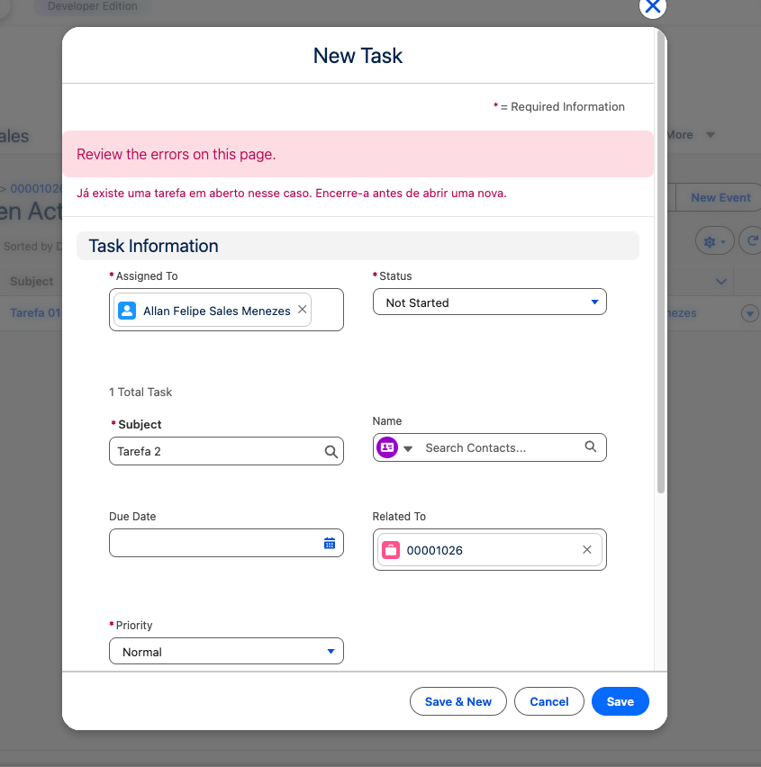

# Triggers - Desafios de Desenvolvimento Apex

**Status do Desafio:** Concluído com Framework ✅
**Padrão:** Trigger Handler Pattern orientado a Interface.

## Desafio 01: Automação de Tarefas (Salesforce Apex)

Este repositório contém a solução do primeiro desafio, focado em regras de negócio para o objeto **Task**. A implementação foi realizada utilizando um **Trigger Framework profissional**, separando as responsabilidades de contexto e lógica.

🎯 Objetivo do Desafio
Impedir a criação de mais de uma **Tarefa (Task)** aberta vinculada a um mesmo **Caso (Case)**. Caso o usuário tente criar uma tarefa duplicada, o sistema deve exibir uma mensagem de erro customizada.

🏗️ Arquitetura Utilizada
Optei por não colocar a lógica diretamente na Trigger (anti-padrão). Em vez disso, utilizei:

1.  **ContratoTrigger (Interface):** Um contrato que padroniza os métodos de execução para todos os Handlers da organização.
2.  **TriggerMaestroGatilho (Dispatcher):** Uma classe responsável por gerenciar o fluxo da Trigger e direcionar os dados para o método correto (Before Insert).
3.  **TaskHandler (Lógica de Negócio):** Classe onde reside a inteligência da validação, garantindo que o código seja testável e de fácil manutenção.

#🛠️ Destaques Técnicos

 **Identificação Dinâmica (SObject Token):** Em vez de utilizar o prefixo fixo `500` (hardcoded) para identificar Casos, utilizei o método `t.WhatId.getSObjectType() == Case.sObjectType`. Isso garante que o código seja robusto e siga as melhores práticas de **Type Safety**.
* **Segurança (Sharing Settings):** A classe foi definida como `with sharing`, assegurando que as regras de visibilidade e permissões da organização sejam respeitadas durante a execução.
* **Performance (Bulkificação):** O código foi desenvolvido para processar coleções de dados, realizando apenas uma query SOQL para validar múltiplos registros simultaneamente, evitando atingir os limites (**Governor Limits**) do Salesforce.

🚀 Como testar
1. Acesse um registro de **Caso**.
2. Crie uma nova **Tarefa** com status "Em Aberto".
3. Tente criar uma **segunda Tarefa** para o mesmo Caso.
4. O sistema impedirá o salvamento com a mensagem: *"Já existe uma tarefa em aberto nesse caso. Encerre-a antes de abrir uma nova."*

---

---

## 📸 Evidências de Teste (Desafio 01)

Realizei o teste funcional no ambiente (Org), onde tentei inserir uma segunda tarefa em um Caso que já possuía uma atividade pendente.

**Cenário:** Caso com "Tarefa 01" em status aberto.
**Ação:** Tentativa de inserção da "Tarefa 02".
 **Resultado:** O framework bloqueou a operação com sucesso, disparando a validação customizada. O registro só seria permitido caso o status da tarefa anterior fosse alterado para "Completed".

**Abaixo, a evidência do erro disparado pelo sistema:**

