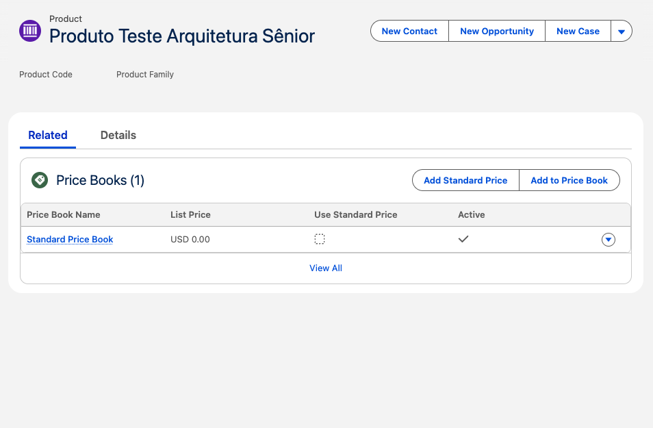

Triggers - Desafios de Desenvolvimento Apex  02

Status do Projeto: Concluído com Framework Profissional ✅

Arquitetura: Trigger Handler Pattern orientado a Interface (SOLID).

Este repositório contém a solução de dois desafios de automação no Salesforce, utilizando um Trigger Framework único e reutilizável. A base construída no primeiro desafio serviu como motor para o segundo, demonstrando escalabilidade e alto nível de reuso de código.

## Desafio 01: Automação de Tarefas (Task)
Objetivo: Impedir a criação de mais de uma Tarefa (Task) aberta vinculada a um mesmo Caso (Case).

Lógica: O sistema verifica se já existe uma atividade pendente. Caso exista, bloqueia a nova inserção com uma mensagem de erro customizada.

Destaque Técnico: Uso de getSObjectType() para evitar IDs fixos (hardcoded) e garantir a robustez do código contra mudanças no ambiente.

## Desafio 02: Automação de Produtos (Product2)
Objetivo: Criar automaticamente uma entrada de preço zerada no Catálogo Padrão (Standard Price Book) sempre que um novo produto for cadastrado.

Lógica: A automação captura o ID do produto recém-criado e gera um registro de PricebookEntry vinculado a ele.

Destaque Técnico: Implementação no contexto after insert, garantindo que o ID do produto já esteja disponível para o vínculo do preço, respeitando a integridade referencial do Salesforce.

## Arquitetura do Framework
A grande vantagem deste projeto é a separação de responsabilidades (SoC), onde o motor foi construído no Projeto 01 e apenas estendido no Projeto 02:

ContratoTrigger (Interface): Padroniza os métodos (Before/After) para todos os Handlers da organização.

TriggerMaestroGatilho (Dispatcher): O "cérebro" que gerencia o fluxo. Escrito uma vez, ele serve para qualquer objeto da Org.

Handlers (Lógica de Negócio): Classes específicas (TaskHandler e ProductHandler) que isolam a inteligência de cada domínio.

## Destaques Técnicos e Boas Práticas
SOLID (Single Responsibility): Cada Handler cuida apenas do seu objeto, facilitando a manutenção e testes unitários.

Segurança e Visibilidade: Uso estratégico de métodos public para comunicação entre o Maestro e os Handlers, mantendo as classes com with sharing.

Performance (Bulkificação): Processamento de listas de registros de uma só vez, respeitando os Governor Limits (uma única query e um único DML por transação).

Type Casting: Conversão dinâmica de SObject para os tipos específicos (Task e Product2) dentro dos Handlers.

## 🚀 Como testar (Desafio 02)
Acesse o objeto Produtos.

Crie um novo registro (ex: "Produto Teste Framework").

Após salvar, acesse a aba Relacionados.

Verifique a lista Preços: o sistema terá criado automaticamente o Standard Price Book com valor 0.00.

## 📸 Evidência de Sucesso (Desafio 02)
Abaixo, a comprovação da automação funcionando. O preço foi gerado instantaneamente via Trigger sem necessidade de intervenção manual:

Agora sim! Está com o visual idêntico ao padrão que a gente estabeleceu. Ficou melhor assim?

OBS: Embora a estrutura de código seja padronizada via Framework, o Projeto 01 foca em Validação de Negócio no Before, enquanto o Projeto 02 foca em Automação de Dados no After, demonstrando como o mesmo motor pode lidar com diferentes necessidades do ciclo de vida de um objeto.